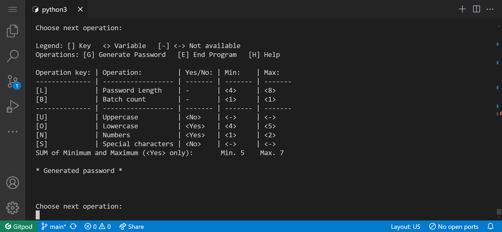

# Password Generator

## Purpose
The Password Generator project aims to provide users with a simple tool to generate secure passwords based on their specified criteria. It offers flexibility in password length, character types, and other settings to meet individual security needs.

## Overview
The Password Generator is a command-line application designed to generate random passwords according to user-defined settings. Users can specify parameters such as inclusion of uppercase letters, lowercase letters, numbers, and special characters, password length and other variables as minimum and maxium provideing advanced flexibility. The generated passwords are designed to be secure and difficult to guess. 
Program limits are set to generate passwords or keys ranging from 1 to 100 passwords in length or 1 to 4096 characters.

## User Stories
- **As a user concerned about online security**, I want a tool to generate strong and unique passwords for my various accounts locally.
- **As a user with specific password requirements**, I want to customize the generated passwords to meet certain criteria.
- **As a developer or IT professional**, I want a lightweight and efficient tool for generating passwords programmatically.

## Features
- **Customizable Password Criteria:** Specify password length and character types.
- **Advanced Password Criteria:** Lengths are defined as minimum and maximum for password length and character types.
- **Random Password Generation:** Generate secure passwords.
- **Generate Key:** Generate a 'long' password up to 4096 characters long, which could be used as a key.
- **Command-Line Interface:** Accessible via the command line for easy integration.
- **Generate Multiple:** Provides a batch function to generate multiple up to 100 passwords.

## Structure
The application consists of a command-line interface for user input and password generation. It simulates fullscreen by filling the terminal height with blank lines. There is a minimal requirement for the terminal to be at least 24 lines high. When generating multiple passwords or longer keys, maintaining screen integrity is not possible on a terminal with minimal dimensions less than 24 rows and 80 columns.

### Screen Components:
- **Title**
- **Legend** 
- **Operations**
- **Settings:** Displays variables and operation keys.
- **SUM:** Provides a check.
- **Generated Password**
- **Blank Lines**
- **Message**

## Development Process
1. **Concept of Functions:** Defining functions that the password generator will provide.
2. **Logical Flow:** Creating a conceptual diagram to achieve password generation based on proposed functions.
3. **Initial Setup:** Setting up the command-line interface and basic structure.
4. **Output Display:** Structuring the screen to provide necessary information and display the generated password.
5. **Random Password Generation:** Developing algorithms for password generation based on provided parameters.
6. **User Input Handling:** Implementing functionality to handle various user inputs.
7. **Testing and Optimization:** Conducting thorough testing and optimizing the code.

## Future Enhancements
- **List Pick Symbols:** Ability to select which special characters will be accepted when the password is generated.
- **Copy to Clipboard:** Easily and safely copy the password to the clipboard and remove it from clipboard memory.
- **Safely Clear Memory:** Safely clean the memory on program exit.
- **Dictionary:** Use dictionaries to generate easily readable passwords with few alterations to create secure passwords.
- **User Profiles:** Save preferred settings as profiles.
- **Password Storage:** Integration with password managers.
- **Password Strength Analysis:** Provide feedback on password strength.
- **GUI Interface:** Develop a graphical user interface.
- **Multi-language Support:** Add localization features.

## Solved Bugs
- **Fullscreen Display:** Proper 'full screen' behavior achieved by developing a method to measure and count terminal rows of individual sections.
- **Negative Values:** Resolved a minor bug caused by a logical error where 'or' was used instead of 'and'.
- **Line Breaking:** Adhered to coding standards when formatting the code to comply with linters like PEP8.

## Unsolved Bugs
- **Clipboard:** Copying to clipboard functionality doesn't work and has been removed for the time being.
- **Fullscreen Discrepancies:** When nearing fullscreen limits (between 22-27 rows), the top of the page sometimes doesn't display optimally, but all important information remains visible.

## Technologies Used
- **Python**: Used for backend development and scripting.
- **Git/GitHub**: Version control system and repository hosting platform.
- **Heroku**: Cloud platform for deploying and hosting the application.
- **OpenAI ChatGPT**: Assisted in generating code snippets, providing guidance, and answering questions during development.

## Testing

## Code validation
Code passes flake8 and pylint validaation with 100% sucess validating run.py and all *.py modules.

## Test Cases

### Change settings - SUM ok - generate password
- User initiates settings, changes them and geanerate password.

| | | | | |
|:-|:-|:-|:-|:-|
| 01. run script | 02. input "u" | 03. input "u" result | 04. input "y" | 05. input "y" result  |
|  |  |  |  |  
| 06. input "2" | 07. input "2" result | 08. input "4" | 09. input "4" result | 10. input "g" |
|  |  |  |  |  
| 11. input "g" result | | | | 
|  |  |  |  |  |

### Change settings - sum problem - fix - generate password
- User initiate settings, changes them, try to generate password, but SUM error is raised. Then user change settings again, SUM shows OK and geanerate password succesfully.

| | | | | |
|:-|:-|:-|:-|:-|
| 01. run script | 02. input "s" | 03. input "s" result | 04. input "y" | 05. input "y" result  |
|  |  |  |  |  |
| 06. input "u" | 07. input "8" result | 08. input "15" | 09. input "15" result  | 10. input "g" |
|  |  |  |  |  |
| 11. input "g" result | 12. input "l" | 13. input "l" result  | 14. input "Return" | 15. input "15" result |
|  |  |  |  |  |
| 16. input "15" result | 17. input "g" | 18. input "g" result  | | | 
|  |  |  |  |  |

### Change settings - cancle settings
- User initiate settings change and cancels it.

| | | | | |
|:-|:-|:-|:-|:-|
| 01. run script | 02. input "s" | 03. input "s" result | 04. input "\\" | 05. input "\\" result |
|  |  |  |  |  |

### Generate multiple passwords
- User initiates settings change and cancels it.

| | | | | |
|:-|:-|:-|:-|:-|
| 01. run script | 02. input "s" | 03. input "s" result | 04. input "\\" | 05. input "\\" result |
|  |  |  |  |  |
| 06.  input "g"  | 07. input "g" result | | | |
|  |  |  |  |  |

### Help Recall
- User initiates help and goes back to home screen.

| | | | | |
|:-|:-|:-|:-|:-|
| 01. run script | 02. input "h" | 03. input "h" result |04. any key to home screen | |
|  |  |  |  |  |

### Exitng
- User exits the script.

| | | | | |
|:-|:-|:-|:-|:-|
| 01. run script | 02. input "e" | 03. input "e" result |
|  |  |  |  |  |

### Terminal resize
- User keeps resizeing terminal by reducing rows.

| | | | | |
|:-|:-|:-|:-|:-|
| 01. run script | 02. input "e" | 03. input "e" result |
|  |  |  |  |  |

## Deployment - Via Heroku pages
- The website is publicly accessible on [Heroku deployment](https://gen-pass-21b0071589ae.herokuapp.com)
- The website repository is hosted on [GitHub repository](https://github.com/houndhunger/gen-pass)

Upon completing any modifications:
1. I added the changes using the command: ```git add .```
2. Followed by committing them with a descriptive message: ```git commit -m “Something done”```
3. Finally, I pushed the changes to the GitHub repository: ```git push```
4. Re-Deployng Branch on [heroku - Deploy](https://dashboard.heroku.com/apps/gen-pass/deploy/github), then browser page was opend (https://gen-pass-21b0071589ae.herokuapp.com/) to display terminal reflected the updates.

## Credits
- Some online generators gave me an idea of basic password generator funcitons: [Lastpass](https://www.lastpass.com/features/password-generator), [Avst](https://www.avast.com/en-gb/random-password-generator#pc), [1password](https://1password.com/password-generator/), [nexcess](https://www.nexcess.net/web-tools/secure-password-generator/), [bitwarden](https://bitwarden.com/password-generator/#password-generator)
- ChatGPT - served me a lot as a 24/7 tutor service, quick code validation, code formarting and much more.
- Big Thank You to my mentor Rohit Sharma who points me right direction every time.

## License
This project is open-source under the MIT License.

---

Secure your online accounts with strong and unique passwords generated by the Password Generator!
